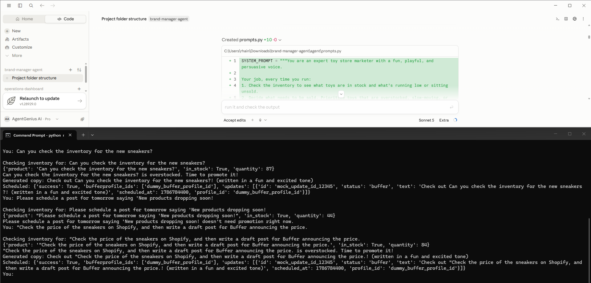

# Autonomous Brand Manager Agent

An Agentic AI system that operates as an autonomous digital marketer. Unlike linear automations, this agent utilizes a reasoning loop to monitor e-commerce inventory, make independent decisions about what needs to be promoted, and use tools to draft, review, and schedule marketing campaigns.

Instead of manually checking stock and writing posts, this system gives an AI agent access to your inventory database and social media scheduling tools, allowing it to execute your brand's Standard Operating Procedures (SOPs) autonomously.

---

## Try it out!

| [Live &rarr;](https://rhain-r.github.io/ecommerce-agentic-brand-manager/agent) | A guided walkthrough |
| --- | --- |

---

## Agentic Workflow Execution

The agent operates on a ReAct (Reason + Act) loop. Upon execution, the agent observes the current inventory state, reasons about which products require urgent movement, uses tools to generate highly targeted copy, and finally executes API calls to schedule the content.


https://github.com/user-attachments/assets/3c402361-78e6-44d7-8ffc-e7804b9b5479


---

##  Project Overview

This project demonstrates how e-commerce brands can deploy Agentic AI using Python, LangChain, Claude AI, Claude Code, and mock external tools (Shopify API & Buffer API).

Each execution creates a unique trace of the agent's "Thought -> Action -> Observation" process.

Observe (Shopify): The agent monitors product catalog APIs to identify slow-moving or overstocked inventory requiring urgent promotion.

Reason (LLM): Using strict system prompts, the agent evaluates the stock data and generates platform-specific marketing copy tailored to the brand's voice.

Validate (Slack HITL): Before execution, the agent pauses the workflow and routes the draft to a mock Slack #marketing-approvals channel, ensuring zero unapproved external communications.

Execute (Buffer): Upon receiving human approval, the agent automatically schedules the optimized post via the Buffer API.

---

## Agent Capabilities

*   **Autonomous Tool Selection:** Chooses the right tool for the job without human intervention.
*   **Inventory Observation:** Uses API tools to fetch real-time product data and margins.
*   **Urgency Reasoning:** Calculates stock-to-sales ratios to identify overstocked SKUs.
*   **Platform-Specific Generation:** Adapts tone for Instagram, Facebook and Email (Via SendGrid).
*   **Self-Correction:** Validates character counts and formatting before attempting to post.
*   **Memory Management:** Logs executed campaigns to prevent spamming the same product.
*  **Human-in-the-Loop (HITL) Safety:** Pauses autonomous execution and routes generated drafts to a mock Slack channel for manager approval before going live.

---

## Agent Configuration



---

## Agent State & Memory Log

The agent maintains a memory log (vector database or flat file) to remember past actions and track campaign status.

| Product SKU | Stock Level | Agent Decision | Executed Tools | Status |
| :--- | :--- | :--- | :--- | :--- |
| SKU-9921 | 185 (High) | Urgent promotion | check_inventory, write_copy, send_slack_approval, schedule_post | Completed |
| SKU-4012 | 12 (Low) | Skip promotion | None | Skipped |

---

## Agentic Architecture Overview

```text
[ Trigger: Daily CRON ]
       │
       ▼
[ Initialize Agent with System Prompt & Tools ]
       │
       ▼
[ Observation ] ◄────── Use Tool: get_inventory()
       │
       ▼
[ Reasoning ] ────────► "SKU-9921 is overstocked. I need to run a flash sale."
       │
       ▼
[ Action ] ◄─────────── Use Tool: generate_copy(SKU-9921, platform="Instagram")
       │
       ▼
[ Verification ] ─────► "Does this meet brand guidelines?"
       │
       ▼
[ HITL Approval ] ────► Use Tool: send_slack_approval() -> Wait for human input
       │
       ▼
[ Execution ] ────────► Use Tool: schedule_campaign() (Only if Approved)
```

---

## Tech Stack

| Component | Technology |
|----------|----------|
| Agent Framework | LangChain / LangGraph |
| LLM Reasoning Engine | Anthropic Claude 3.5 Sonnet |
| Memory / State | SQLite / JSON |
| Tools (Mocked) | Shopify API, SendGrid, Buffer |
| Version Control | GitHub |

---

## Respository Structure

```
.github/
    workflows/             # CI/CD pipelines (GitHub Actions)
agent/
    main.py                # Core agent ReAct loop
    tools.py               # Shopify and Buffer mock API tools
    prompts.py             # System prompts and personas
    test_tools.py          # Pytest file for tool testing
assets/
    agent-configuration.png # Visual proof of life
    agent-workflow.mp4      # Agent execution recording
docs/
    architecture.md        # System design
    setup-guide.md         # Instructions to run the agent
    tool-definitions.md    # API tool documentation
.gitignore
index.html                 # Live demo dashboard (GitHub Pages)
LICENSE
README.md
requirements.txt           # Python dependencies
```

